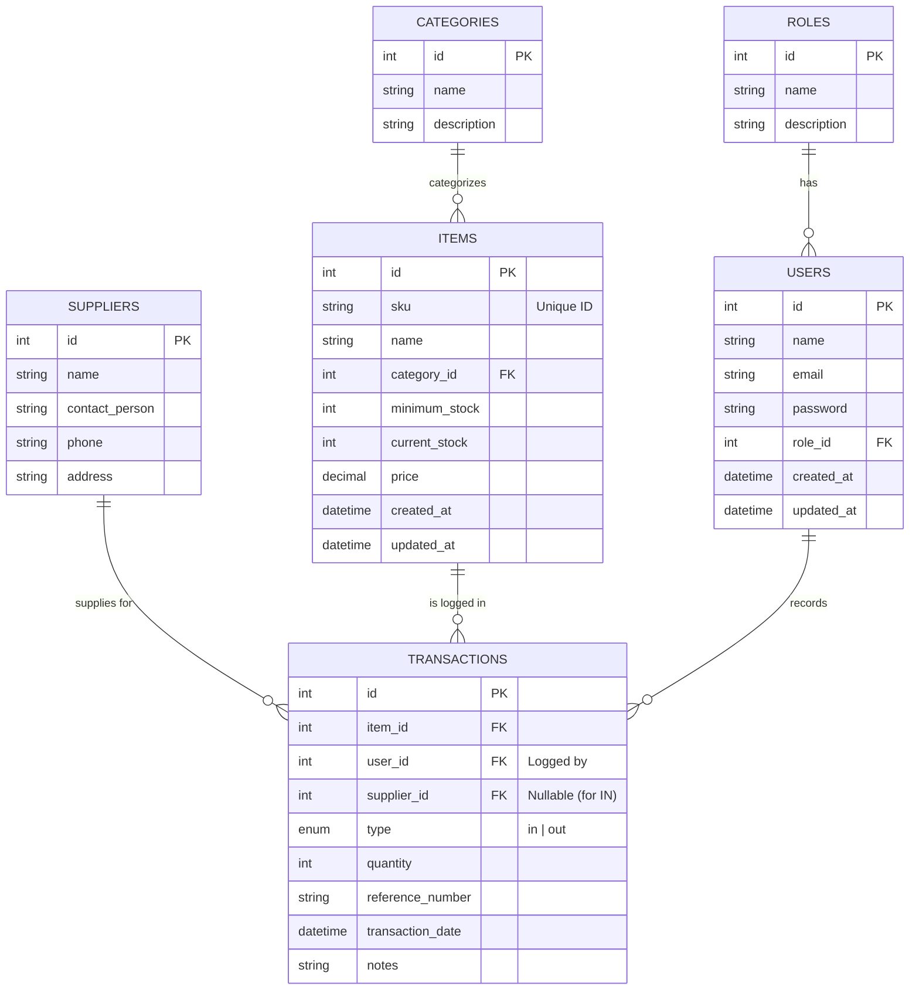

# Product Requirements Document (PRD)
## Sistem Manajemen Inventaris Barang (Inventory Management System)

**Dokumen Versi:** 1.0
**Status:** Draft
**Dibuat Oleh:** Senior Product Manager & Tech Lead
**Tanggal:** 17 Juli 2026

---

## 1. Ringkasan Eksekutif (Executive Summary)
Sistem Manajemen Inventaris Barang adalah aplikasi berbasis web yang dirancang untuk membantu perusahaan dalam mengelola, melacak, dan mengontrol pergerakan stok barang secara *real-time*. Sistem ini bertujuan untuk mengurangi tingkat kesalahan pencatatan manual, mempercepat proses opname barang (audit fisik), serta menyajikan pelaporan data yang akurat untuk mendukung pengambilan keputusan strategis oleh manajemen.

## 2. Tujuan & Sasaran (Objectives & Goals)
*   **Akurasi Data:** Mencapai 99% akurasi pencatatan stok fisik versus sistem.
*   **Efisiensi Operasional:** Mengurangi waktu yang dibutuhkan untuk proses *stock opname* dan pelacakan barang keluar/masuk hingga 50%.
*   **Transparansi & Akuntabilitas:** Menyediakan jejak audit (*audit trail*) yang terperinci untuk setiap transaksi, lengkap dengan pelacakan pengguna yang melakukan input.

## 3. Pengguna Sasaran (Target Audience)
1.  **Admin / Superadmin:** Memiliki hak akses sistem penuh untuk mengatur kelola pengguna, penetapan peran (RBAC), serta konfigurasi global dari sistem.
2.  **Staf Gudang (Warehouse Staff):** Bertugas penuh sebagai eksekutor di lapangan yang melakukan input data transaksi pergerakan stok masuk (*Inbound*) dan barang keluar (*Outbound*).
3.  **Manajer Operasional (Manager):** Membutuhkan akses *read-only* (melihat) menuju dashboard dan pelaporan analitik untuk evaluasi performa inventaris tanpa bisa mengubah master data.

## 4. Fitur Utama (Key Features & Requirements)

### 4.1. Autentikasi & Otorisasi
*   Mekanisme otentikasi login menggunakan email dan kata sandi yang aman.
*   Manajemen peran (Role-based Access Control - RBAC) untuk membatasi ruang akses per fitur khusus bagi Admin, Staf, dan Manajer.

### 4.2. Dashboard (Ringkasan Sistem)
*   Visualisasi metrik kunci: total item aktif, valuas total stok, dan *low stock alerts* (peringatan barang habis/menipis).
*   Grafik (Chart) tren historikal transaksi (barang masuk vs barang keluar) pada kurun 30 hari terakhir.

### 4.3. Manajemen Master Data (Core CRUD)
*   **Manajemen Kategori:** Pengaturan taksonomi atau kategori kelompok dari barang.
*   **Manajemen Supplier:** Buku kontak entitas pemasok (nama, kontak, alamat).
*   **Manajemen Barang (Items):** Penambahan, perubahan, dan penonaktifan barang yang mencakup penamaan, *Stock Keeping Unit* (SKU), relasi kategori, relasi harga, dan pengaturan kuota batas minimum.

### 4.4. Manajemen Transaksi (Inbound/Outbound)
*   **Barang Masuk (Stock In):** Mencatat log penerimaan barang dari pihak Supplier yang menambah kuantitas angka *current stock*.
*   **Barang Keluar (Stock Out):** Mencatat log pengeluaran barang untuk kebutuhan produksi, *supply chain*, atau pelanggan yang mengurangi angka *current stock*.
*   Tiap transaksi harus *immutable* (tidak bisa diubah seenaknya tanpa jejak) dan mencatat tanggal log, referensi (nomor surat jalan/dokumen), kuantitas, catatan, dan *PIC* (*User ID*).

### 4.5. Laporan (Reporting & Analytics)
*   Pelaporan komprehensif terkait sejarah pergerakan stok selama periode/waktu (*date range*) yang dipilih.
*   Fungsi ekspor data laporan yang ramah-unduh ke format PDF maupun CSV/Excel.

---

## 5. Skema Data & Arsitektur (Data Schema & Architecture)

Sistem akan dirancang dengan pola *Monolithic Architecture* menggunakan kerangka kerja (contoh: Laravel) dan pola *Model-View-Controller (MVC)*. Lapisan penyimpanan (*storage layer*) difasilitasi oleh Relational Database Management System (RDBMS).

### 5.1. Penjelasan Naratif (Narrative Explanation)
Struktur basis data mencakup 6 entitas tabel utama:
1.  **USERS:** Menyimpan kredensial otentikasi serta profil pengguna. Terhubung secara relasional ke tabel *Roles* sebagai penetapan hak izin akses.
2.  **ROLES:** Sebagai kamus data rujukan peran otorisasi pengguna.
3.  **CATEGORIES:** Referensi klasifikasi entitas *Items* untuk meringankan kinerja pencarian dan penyortiran laporan.
4.  **SUPPLIERS:** Merepresentasikan pemasok barang. 
5.  **ITEMS:** Entitas pusat. Menyimpan informasi SKU unik, deskripsi, parameter `minimum_stock`, harga, dan melacak `current_stock`.
6.  **TRANSACTIONS:** Bertindak sebagai rekam jejak (*log*) historis riwayat inventaris. Terdapat kolom `type` dengan batasan _in_ atau _out_. Jika ada transaksi _in_, secara opsional dihubungkan dengan id *Supplier*. ID *User* pencatat, ID *Item*, kuantitas (*quantity*), serta waktu log dicatat permanen dalam tabel ini. 

### 5.2. Visualisasi ERD (Entity Relationship Diagram)

---

## 6. Persyaratan Non-Fungsional (Non-Functional Requirements)
*   **Performa (*Performance*):** Muat tayangan antarmuka (contoh: *Items List* dan *Dashboard*) harus kurang dari 2 detik. 
*   **Keamanan (*Security*):** Seluruh rute aplikasi (kecuali halaman login) membutuhkan validasi otorisasi aktif. Seluruh *password* ter-*hash* aman secara kriptografis (misal: *Bcrypt*). Cegah potensi *SQL Injection* dengan menggunakan *ORM/Query Builder*.
*   **Daya Tanggap Antarmuka (*UI Responsiveness*):** Antarmuka wajib bersifat adaptif (*Mobile/Tablet Friendly*) karena staf gudang bisa jadi menggunakan tablet untuk beroperasi secara nomaden.
*   **Skalabilitas Data (*Data Scalability*):** Tabel `TRANSACTIONS` dan `ITEMS` harus mempunyai *database indexing* yang tepat (khususnya untuk parameter *SKU*, *Item Name*, *Date*) agar siap diisi oleh ratusan ribu *rows* tanpa gangguan memori parah.

## 7. Pengembangan Masa Depan (Future Enhancements V2)
*   **Pemindai Barcode/QR (Barcode Scanner Integration):** Fitur PWA (*Progressive Web App*) yang mengaktifkan kamera perangkat guna *scanning barcode* barang memangkas kesalahan sentuh dan ketik manual.
*   **Sistem Notifikasi Push / Email:** Sistem *CRON scheduler* harian yang otomatis mengirim surel ringkasan kepada eksekutif jika ada item krusial yang sudah terjun ke angka batas bawah *minimum stock*.
*   **Fasilitas Multigudang (Multi-Warehouse):** Memisahkan manajemen penempatan kompartemen yang mencakup transfer (*Transfer Order*) stok antar gudang.
